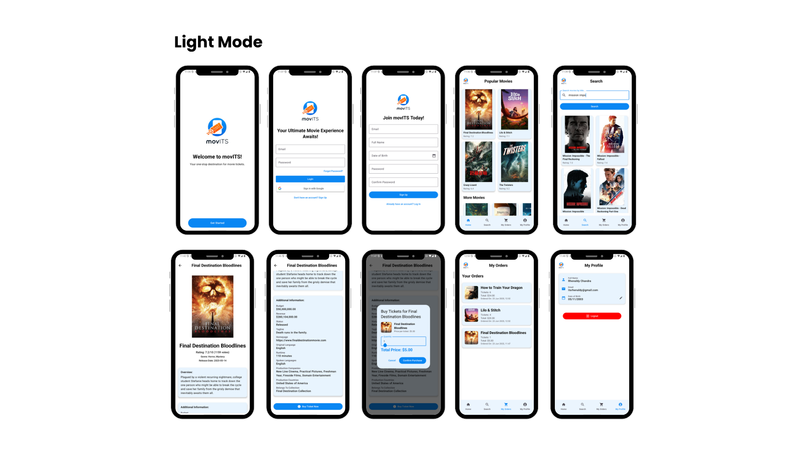
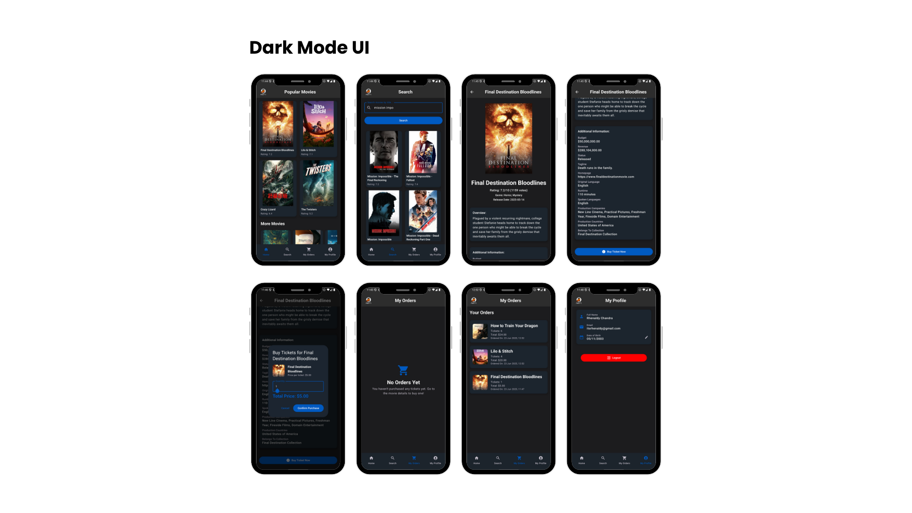

# movITS

Final Project Mobile Programming

|    NRP     |         Name         |
|:----------:|:--------------------:|
| 5025221170 |    Billy Jonathan    |
| 5025221189 | Ignatius Ida Bagus A |
| 5025221190 |   Rhenaldy Chandra   |

## Deskripsi Proyek

movITS adalah aplikasi mobile berbasis Android yang memungkinkan pengguna untuk mencari, melihat detail, dan melakukan pemesanan tiket film dari database online. Aplikasi ini terintegrasi dengan [The Movie Database (TMDB) API](https://www.themoviedb.org/documentation/api) untuk mendapatkan daftar film, detail, dan poster, serta menggunakan Firebase untuk manajemen autentikasi dan data pengguna.

## Fitur Utama

- **Autentikasi Pengguna:** Login menggunakan Google Sign-In dan Firebase Authentication.
- **Pencarian Film:** Cari film berdasarkan judul menggunakan TMDB API.
- **Daftar Film Populer:** Menampilkan film-film terpopuler secara dinamis.
- **Detail Film:** Informasi lengkap tentang film, seperti poster, sinopsis, rating, tanggal rilis, bahasa, dan produksi.
- **Pemesanan Tiket:** Pengguna dapat memesan tiket film dan data pesanan tersimpan di Firebase.
- **Profil Pengguna:** Setiap pengguna dapat menyimpan dan mengupdate data pribadi seperti nama dan tanggal lahir.

## Instalasi & Menjalankan Aplikasi

1. **Clone Repository**
   ```
   git clone https://github.com/Etpaxtysus/movITS.git
   ```

2. **Buka dengan Android Studio**
    - Import project ke Android Studio.

3. **Konfigurasi API Key**
    - Daftarkan diri di [TMDB](https://www.themoviedb.org/) untuk mendapatkan API Key.
    - Masukkan API Key ke variabel `API_KEY` di file `MovieAPIService.kt`.

4. **Konfigurasi Firebase**
    - Buat project baru di [Firebase Console](https://console.firebase.google.com/).
    - Download dan tempatkan file `google-services.json` pada folder `app/`.

5. **Jalankan Aplikasi**
    - Pastikan emulator atau perangkat fisik terhubung.
    - Klik tombol "Run".

## Struktur Proyek

```
app/
 └── src/
      └── main/
           └── java/com/example/fpmobileprogramming/
                 ├── MainActivity.kt
                 ├── MovieAPIService.kt
                 ├── MovieViewModel.kt
                 ├── MovieSearchViewModel.kt
                 ├── MovieDetailScreen.kt
                 ├── LoginScreen.kt
                 ├── HomeScreen.kt
                 ├── Movie.kt
           └── res/
                 └── layout/
                 └── values/
      └── test/
      └── androidTest/
 ```

## Teknologi yang Digunakan

- **Kotlin**
- **Jetpack Compose** (UI Modern)
- **Firebase Authentication & Firestore**
- **TMDB API**
- **Ktor Client** (Untuk Networking)
- **Google Sign-In**

## Interface Aplikasi

### Light Mode


### Dark Mode
